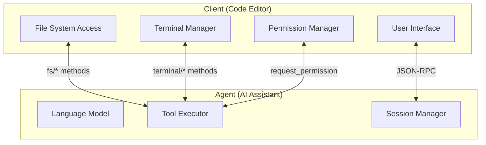
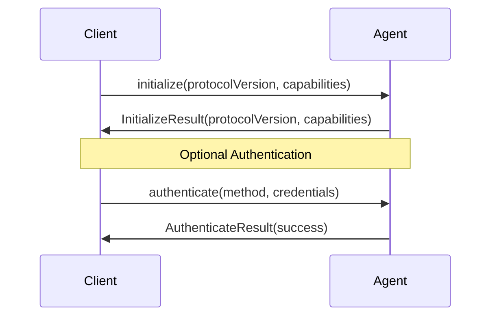
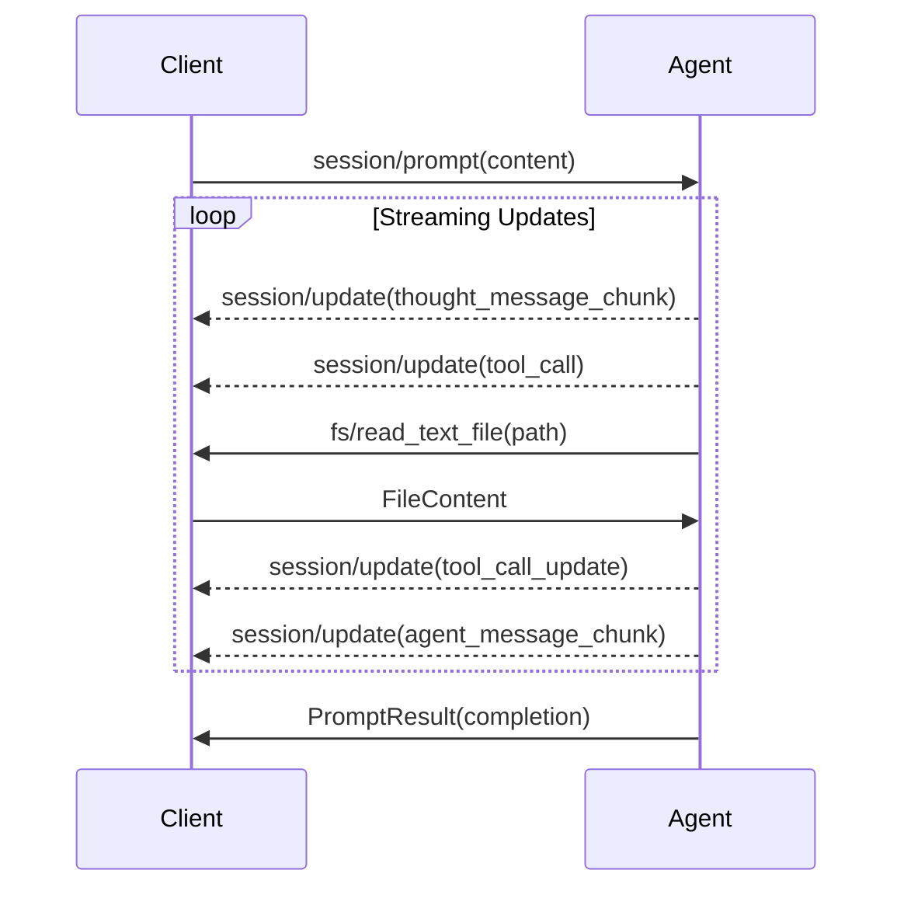
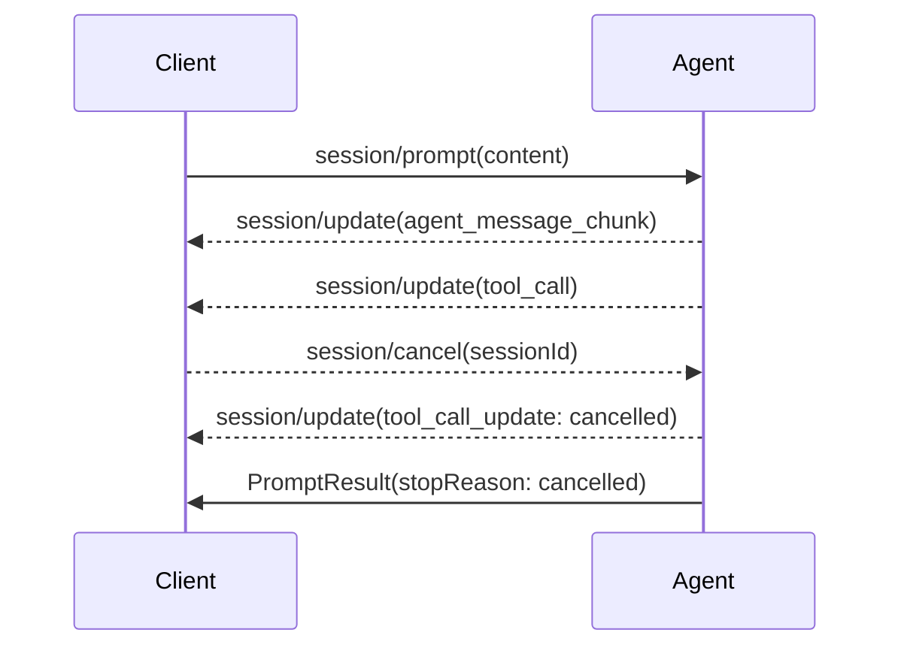
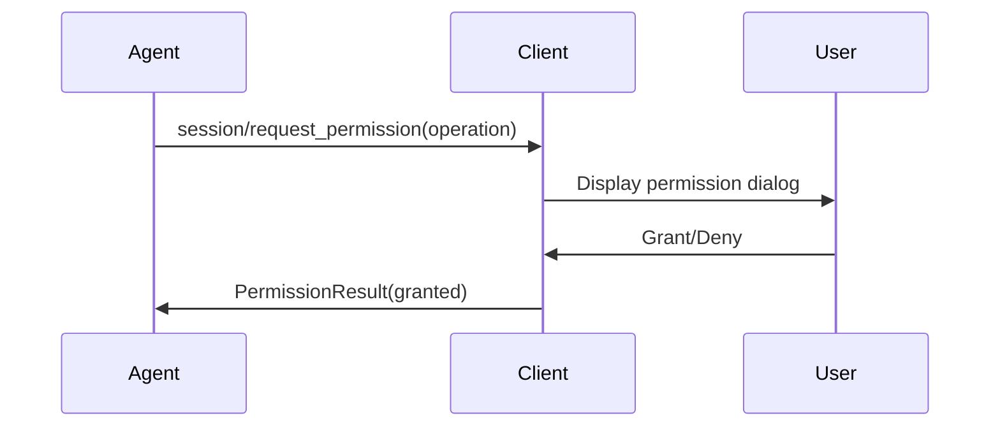
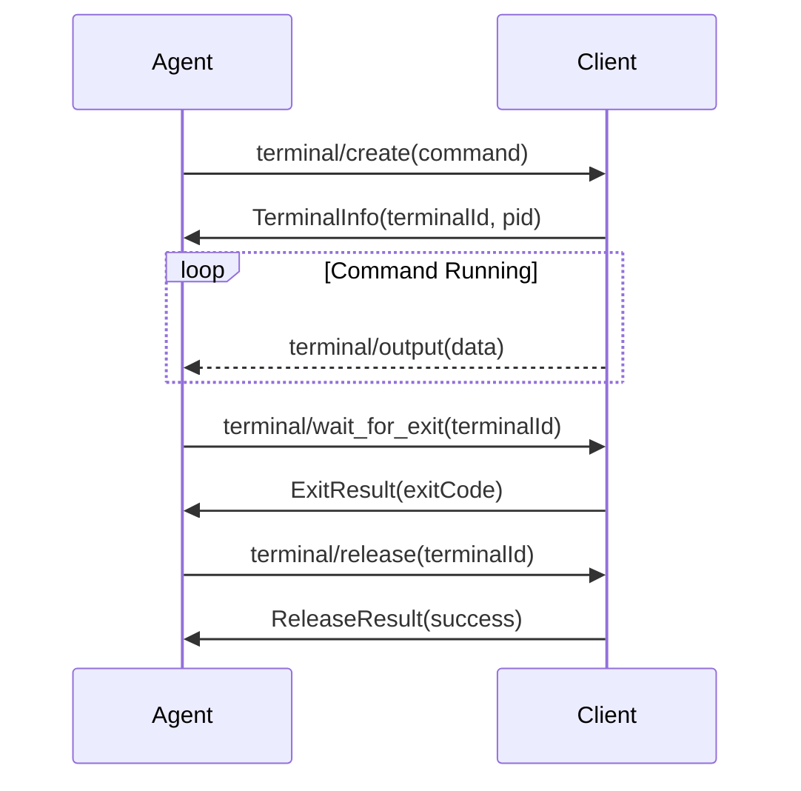
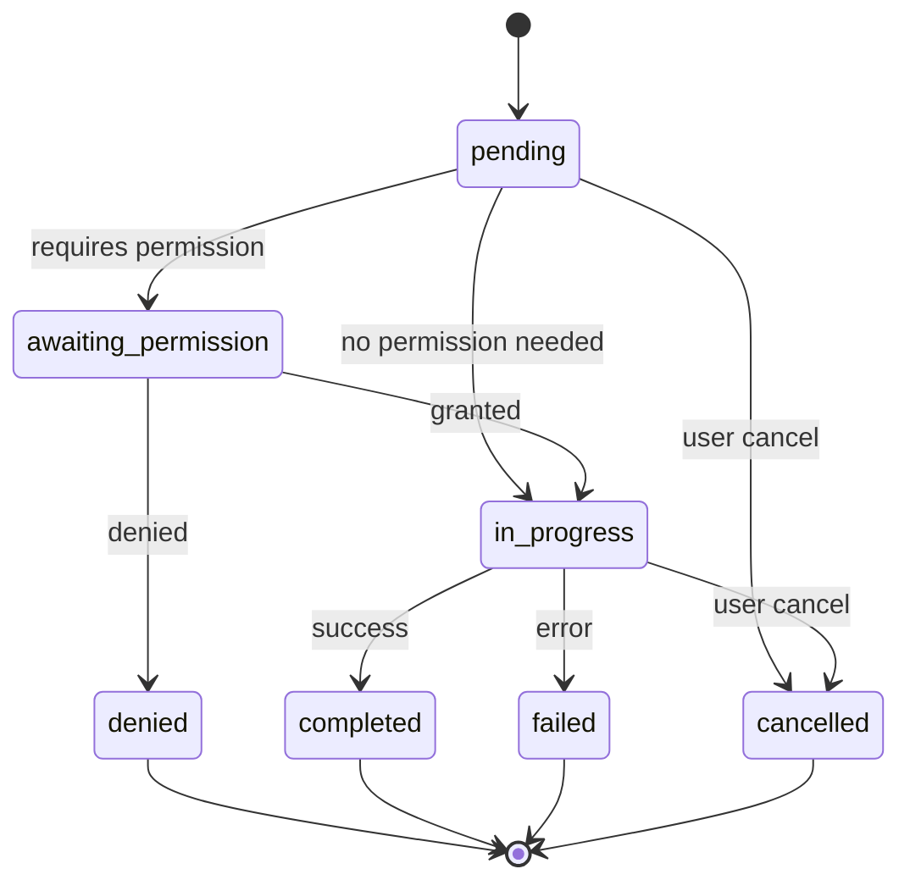
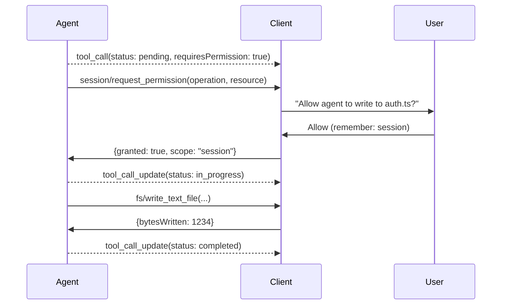

# Agent Client Protocol (ACP) Specification

**Version:** 1.0
**Status:** Draft
**Last Updated:** 2026-02-04

---

## Table of Contents

1. [Executive Summary](#1-executive-summary)
2. [Design Philosophy](#2-design-philosophy)
3. [Architecture Overview](#3-architecture-overview)
4. [Protocol Lifecycle](#4-protocol-lifecycle)
5. [Complete Method Reference](#5-complete-method-reference)
6. [Notifications Reference](#6-notifications-reference)
7. [Session Update Types](#7-session-update-types)
8. [Tool Calls Deep Dive](#8-tool-calls-deep-dive)
9. [Content Blocks](#9-content-blocks)
10. [Capability System](#10-capability-system)
11. [MCP Integration](#11-mcp-integration)
12. [Session Modes](#12-session-modes)
13. [Extensibility](#13-extensibility)
14. [Security Considerations](#14-security-considerations)
15. [Error Handling](#15-error-handling)
16. [Implementation Guidelines](#16-implementation-guidelines)
17. [Version History and Future Roadmap](#17-version-history-and-future-roadmap)

---

## 1. Executive Summary

### What is ACP?

The Agent Client Protocol (ACP) is a standardized communication protocol that enables AI coding agents to interact with code editors and development environments. ACP defines a bidirectional JSON-RPC 2.0 interface between a **Client** (typically a code editor or IDE) and an **Agent** (an AI-powered coding assistant).

### Why ACP Exists

Modern AI coding assistants require deep integration with development environments to be effective. They need to:

- Read and write files in the user's workspace
- Execute terminal commands
- Request permissions for sensitive operations
- Stream responses in real-time
- Maintain conversation context across sessions

ACP standardizes these interactions, allowing any compliant agent to work with any compliant client, fostering an ecosystem of interoperable AI development tools.

### Who It's For

- **Client Developers:** IDE/editor teams building AI assistant integrations
- **Agent Developers:** Teams building AI coding assistants
- **Tool Providers:** MCP server developers extending agent capabilities
- **Platform Providers:** Cloud and enterprise environments hosting AI agents

---

## 2. Design Philosophy

### 2.1 MCP-Friendly

ACP is designed to complement the Model Context Protocol (MCP) rather than compete with it.

- **Built on JSON-RPC 2.0:** Uses the same transport layer as MCP
- **Reuses MCP Types:** Content blocks, resource references, and capability patterns align with MCP
- **MCP Integration First-Class:** Agents can expose MCP servers to clients, and clients can provide MCP servers to agents
- **Future MCP-over-ACP:** Protocol allows routing MCP traffic through ACP connections

### 2.2 UX-First

ACP prioritizes user experience challenges unique to AI agent interactions:

- **Streaming Updates:** Real-time visibility into agent thinking and actions
- **Permission System:** Granular control over agent capabilities
- **Tool Call Visibility:** Users can see exactly what the agent is doing
- **Cancellation Support:** Users can stop operations at any point
- **Session Persistence:** Conversations can be saved and resumed

### 2.3 Trusted Model

ACP operates on a trusted relationship model:

- The **Client** (code editor) is trusted by the user
- The **Agent** is trusted by the Client with controlled access
- The Client mediates all file system and terminal access
- Permissions can be granted, denied, or revoked dynamically

---

## 3. Architecture Overview

### 3.1 Communication Model

ACP uses JSON-RPC 2.0 as its communication foundation. All messages are JSON objects conforming to the JSON-RPC 2.0 specification.

```json
{
  "jsonrpc": "2.0",
  "id": 1,
  "method": "session/prompt",
  "params": {
    "sessionId": "sess_abc123",
    "content": [{ "type": "text", "text": "Hello, agent!" }]
  }
}
```

### 3.2 Transport Mechanisms

#### 3.2.1 Standard I/O (stdio) - Primary

The primary transport mechanism runs the agent as a subprocess:

- Client spawns agent process
- Communication via stdin/stdout
- stderr reserved for logging
- Clean process lifecycle management

```
┌─────────────┐     stdin      ┌─────────────┐
│             │ ─────────────► │             │
│   Client    │                │    Agent    │
│   (IDE)     │ ◄───────────── │  (Process)  │
│             │     stdout     │             │
└─────────────┘                └─────────────┘
```

#### 3.2.2 HTTP (Optional)

For remote or service-based agents:

- Agent runs as HTTP server
- Client connects via HTTP/HTTPS
- Supports load balancing and scaling
- Requires authentication

### 3.3 Client-Agent Relationship



### 3.4 Concurrent Sessions

ACP supports multiple concurrent sessions:

- Each session has a unique `sessionId`
- Sessions are independent (separate conversation contexts)
- A single agent process MAY handle multiple sessions
- Clients SHOULD support multiple simultaneous sessions

---

## 4. Protocol Lifecycle

### 4.1 Initialization Phase



#### Initialize Request

```json
{
  "jsonrpc": "2.0",
  "id": 1,
  "method": "initialize",
  "params": {
    "protocolVersion": 1,
    "clientInfo": {
      "name": "VS Code",
      "version": "1.85.0"
    },
    "capabilities": {
      "fs": {
        "read": true,
        "write": true
      },
      "terminal": {
        "create": true,
        "interactive": false
      }
    }
  }
}
```

#### Initialize Response

```json
{
  "jsonrpc": "2.0",
  "id": 1,
  "result": {
    "protocolVersion": 1,
    "agentInfo": {
      "name": "Claude Agent",
      "version": "1.0.0"
    },
    "capabilities": {
      "loadSession": true,
      "mcpCapabilities": {
        "servers": true,
        "transport": ["stdio", "http"]
      },
      "promptCapabilities": {
        "streaming": true,
        "cancellation": true
      },
      "sessionCapabilities": {
        "modes": ["default", "plan", "code"],
        "configOptions": ["autoApprove", "maxTokens"]
      }
    }
  }
}
```

### 4.2 Authentication (Optional)

Authentication is OPTIONAL but RECOMMENDED for HTTP transports.

```json
{
  "jsonrpc": "2.0",
  "id": 2,
  "method": "authenticate",
  "params": {
    "method": "api_key",
    "credentials": {
      "apiKey": "sk-..."
    }
  }
}
```

Supported authentication methods:
- `api_key`: Simple API key authentication
- `oauth2`: OAuth 2.0 bearer tokens
- `custom`: Implementation-specific methods

### 4.3 Session Setup

#### Creating a New Session

```json
{
  "jsonrpc": "2.0",
  "id": 3,
  "method": "session/new",
  "params": {
    "workingDirectory": "/home/user/project",
    "mcpServers": [
      {
        "name": "filesystem",
        "transport": {
          "type": "stdio",
          "command": "mcp-server-filesystem",
          "args": ["/home/user/project"]
        }
      }
    ],
    "systemPrompt": "You are a helpful coding assistant."
  }
}
```

#### Loading an Existing Session

```json
{
  "jsonrpc": "2.0",
  "id": 4,
  "method": "session/load",
  "params": {
    "sessionId": "sess_abc123"
  }
}
```

### 4.4 Prompt Turn



#### Prompt Request

```json
{
  "jsonrpc": "2.0",
  "id": 5,
  "method": "session/prompt",
  "params": {
    "sessionId": "sess_abc123",
    "content": [
      {
        "type": "text",
        "text": "Please refactor the auth module to use async/await"
      }
    ]
  }
}
```

#### Prompt Response (After Completion)

```json
{
  "jsonrpc": "2.0",
  "id": 5,
  "result": {
    "stopReason": "end_turn",
    "usage": {
      "inputTokens": 1500,
      "outputTokens": 2300
    }
  }
}
```

### 4.5 Cancellation Flow



#### Cancel Notification

```json
{
  "jsonrpc": "2.0",
  "method": "session/cancel",
  "params": {
    "sessionId": "sess_abc123"
  }
}
```

---

## 5. Complete Method Reference

### 5.1 Agent Methods (Client → Agent)

These methods are called by the Client and handled by the Agent.

#### 5.1.1 `initialize`

Initializes the protocol connection with version negotiation and capability exchange.

**Request Parameters:**

| Field | Type | Required | Description |
|-------|------|----------|-------------|
| `protocolVersion` | integer | Yes | Protocol version (currently 1) |
| `clientInfo` | ClientInfo | Yes | Information about the client |
| `capabilities` | ClientCapabilities | Yes | Client capabilities |
| `_meta` | object | No | Extension metadata |

**Response Result:**

| Field | Type | Required | Description |
|-------|------|----------|-------------|
| `protocolVersion` | integer | Yes | Negotiated protocol version |
| `agentInfo` | AgentInfo | Yes | Information about the agent |
| `capabilities` | AgentCapabilities | Yes | Agent capabilities |

#### 5.1.2 `authenticate`

Authenticates the client with the agent.

**Request Parameters:**

| Field | Type | Required | Description |
|-------|------|----------|-------------|
| `method` | string | Yes | Authentication method |
| `credentials` | object | Yes | Method-specific credentials |

**Response Result:**

| Field | Type | Required | Description |
|-------|------|----------|-------------|
| `success` | boolean | Yes | Whether authentication succeeded |
| `error` | string | No | Error message if failed |
| `expiresAt` | string | No | ISO 8601 expiration timestamp |

#### 5.1.3 `session/new`

Creates a new conversation session.

**Request Parameters:**

| Field | Type | Required | Description |
|-------|------|----------|-------------|
| `workingDirectory` | string | Yes | Absolute path to working directory |
| `mcpServers` | MCPServerConfig[] | No | MCP servers to connect |
| `systemPrompt` | string | No | Custom system prompt |
| `initialMode` | string | No | Starting mode (default: "default") |
| `configOptions` | object | No | Initial configuration options |

**Response Result:**

| Field | Type | Required | Description |
|-------|------|----------|-------------|
| `sessionId` | string | Yes | Unique session identifier |
| `createdAt` | string | Yes | ISO 8601 creation timestamp |

#### 5.1.4 `session/load`

Loads an existing session from persistent storage.

**Request Parameters:**

| Field | Type | Required | Description |
|-------|------|----------|-------------|
| `sessionId` | string | Yes | Session ID to load |

**Response Result:**

| Field | Type | Required | Description |
|-------|------|----------|-------------|
| `sessionId` | string | Yes | Loaded session ID |
| `workingDirectory` | string | Yes | Session working directory |
| `mode` | string | Yes | Current session mode |
| `configOptions` | object | Yes | Current configuration |
| `messageCount` | integer | Yes | Number of messages in history |

**Error Conditions:**
- Session not found
- Session expired
- Session corrupted

#### 5.1.5 `session/prompt`

Sends a user prompt to the agent and receives streaming updates.

**Request Parameters:**

| Field | Type | Required | Description |
|-------|------|----------|-------------|
| `sessionId` | string | Yes | Target session ID |
| `content` | ContentBlock[] | Yes | User message content |
| `attachments` | Attachment[] | No | File attachments |

**Response Result:**

| Field | Type | Required | Description |
|-------|------|----------|-------------|
| `stopReason` | string | Yes | Why generation stopped |
| `usage` | UsageStats | No | Token usage statistics |

**Stop Reasons:**
- `end_turn`: Agent completed response naturally
- `cancelled`: User cancelled the request
- `max_tokens`: Token limit reached
- `error`: An error occurred

#### 5.1.6 `session/set_mode`

Changes the agent's operating mode within a session.

**Request Parameters:**

| Field | Type | Required | Description |
|-------|------|----------|-------------|
| `sessionId` | string | Yes | Target session ID |
| `mode` | string | Yes | New mode identifier |

**Response Result:**

| Field | Type | Required | Description |
|-------|------|----------|-------------|
| `previousMode` | string | Yes | Mode before change |
| `currentMode` | string | Yes | Mode after change |

#### 5.1.7 `session/set_config_option`

Updates a session configuration option.

**Request Parameters:**

| Field | Type | Required | Description |
|-------|------|----------|-------------|
| `sessionId` | string | Yes | Target session ID |
| `key` | string | Yes | Configuration key |
| `value` | any | Yes | New value |

**Response Result:**

| Field | Type | Required | Description |
|-------|------|----------|-------------|
| `key` | string | Yes | Configuration key |
| `previousValue` | any | No | Value before change |
| `currentValue` | any | Yes | Value after change |

### 5.2 Client Methods (Agent → Client)

These methods are called by the Agent and handled by the Client.

#### 5.2.1 `session/request_permission`

Requests user permission for a specific action.



**Request Parameters:**

| Field | Type | Required | Description |
|-------|------|----------|-------------|
| `sessionId` | string | Yes | Session requesting permission |
| `operation` | string | Yes | Operation type |
| `resource` | string | Yes | Resource being accessed |
| `reason` | string | No | Why permission is needed |
| `toolCallId` | string | No | Associated tool call ID |

**Operation Types:**
- `file_read`: Read a file
- `file_write`: Write/create a file
- `file_delete`: Delete a file
- `terminal_execute`: Execute a command
- `network_access`: Access network resources
- `mcp_tool`: Use an MCP tool

**Response Result:**

| Field | Type | Required | Description |
|-------|------|----------|-------------|
| `granted` | boolean | Yes | Whether permission was granted |
| `remember` | boolean | No | Remember this decision |
| `scope` | string | No | Scope of permission grant |

**Permission Scopes:**
- `once`: This request only
- `session`: This session
- `workspace`: This workspace
- `always`: Permanent

#### 5.2.2 `fs/read_text_file`

Reads a text file from the client's file system.

**Request Parameters:**

| Field | Type | Required | Description |
|-------|------|----------|-------------|
| `path` | string | Yes | Absolute file path |
| `encoding` | string | No | Text encoding (default: "utf-8") |
| `startLine` | integer | No | First line to read (1-indexed) |
| `endLine` | integer | No | Last line to read |

**Response Result:**

| Field | Type | Required | Description |
|-------|------|----------|-------------|
| `content` | string | Yes | File content |
| `encoding` | string | Yes | Actual encoding used |
| `totalLines` | integer | No | Total lines in file |
| `truncated` | boolean | No | Whether content was truncated |

#### 5.2.3 `fs/write_text_file`

Writes content to a text file.

**Request Parameters:**

| Field | Type | Required | Description |
|-------|------|----------|-------------|
| `path` | string | Yes | Absolute file path |
| `content` | string | Yes | Content to write |
| `encoding` | string | No | Text encoding (default: "utf-8") |
| `createDirectories` | boolean | No | Create parent directories |
| `overwrite` | boolean | No | Overwrite existing file |

**Response Result:**

| Field | Type | Required | Description |
|-------|------|----------|-------------|
| `bytesWritten` | integer | Yes | Number of bytes written |
| `created` | boolean | Yes | Whether file was created |

#### 5.2.4 `terminal/create`

Creates a new terminal instance.



**Request Parameters:**

| Field | Type | Required | Description |
|-------|------|----------|-------------|
| `command` | string | Yes | Command to execute |
| `args` | string[] | No | Command arguments |
| `cwd` | string | No | Working directory |
| `env` | object | No | Environment variables |
| `timeout` | integer | No | Timeout in milliseconds |

**Response Result:**

| Field | Type | Required | Description |
|-------|------|----------|-------------|
| `terminalId` | string | Yes | Unique terminal identifier |
| `pid` | integer | No | Process ID |

#### 5.2.5 `terminal/output`

Delivers terminal output to the agent (Client → Agent notification-style call).

**Request Parameters:**

| Field | Type | Required | Description |
|-------|------|----------|-------------|
| `terminalId` | string | Yes | Terminal identifier |
| `data` | string | Yes | Output data |
| `stream` | string | No | "stdout" or "stderr" |

**Response Result:**

| Field | Type | Required | Description |
|-------|------|----------|-------------|
| `received` | boolean | Yes | Whether output was received |

#### 5.2.6 `terminal/wait_for_exit`

Waits for a terminal process to exit.

**Request Parameters:**

| Field | Type | Required | Description |
|-------|------|----------|-------------|
| `terminalId` | string | Yes | Terminal identifier |
| `timeout` | integer | No | Maximum wait time (ms) |

**Response Result:**

| Field | Type | Required | Description |
|-------|------|----------|-------------|
| `exitCode` | integer | Yes | Process exit code |
| `signal` | string | No | Signal that killed process |
| `timedOut` | boolean | No | Whether timeout occurred |

#### 5.2.7 `terminal/kill`

Terminates a running terminal process.

**Request Parameters:**

| Field | Type | Required | Description |
|-------|------|----------|-------------|
| `terminalId` | string | Yes | Terminal identifier |
| `signal` | string | No | Signal to send (default: "SIGTERM") |
| `force` | boolean | No | Force kill with SIGKILL |

**Response Result:**

| Field | Type | Required | Description |
|-------|------|----------|-------------|
| `killed` | boolean | Yes | Whether process was killed |

#### 5.2.8 `terminal/release`

Releases terminal resources after command completion.

**Request Parameters:**

| Field | Type | Required | Description |
|-------|------|----------|-------------|
| `terminalId` | string | Yes | Terminal identifier |

**Response Result:**

| Field | Type | Required | Description |
|-------|------|----------|-------------|
| `released` | boolean | Yes | Whether terminal was released |

---

## 6. Notifications Reference

Notifications are one-way messages that do not expect a response.

### 6.1 `session/update` (Agent → Client)

Streams incremental updates during prompt processing.

```json
{
  "jsonrpc": "2.0",
  "method": "session/update",
  "params": {
    "sessionId": "sess_abc123",
    "type": "agent_message_chunk",
    "data": {
      "content": "I'll help you refactor",
      "index": 0
    }
  }
}
```

**Parameters:**

| Field | Type | Required | Description |
|-------|------|----------|-------------|
| `sessionId` | string | Yes | Session being updated |
| `type` | string | Yes | Update type (see Section 7) |
| `data` | object | Yes | Type-specific data |
| `timestamp` | string | No | ISO 8601 timestamp |

### 6.2 `session/cancel` (Client → Agent)

Requests cancellation of the current operation.

```json
{
  "jsonrpc": "2.0",
  "method": "session/cancel",
  "params": {
    "sessionId": "sess_abc123",
    "reason": "user_requested"
  }
}
```

**Parameters:**

| Field | Type | Required | Description |
|-------|------|----------|-------------|
| `sessionId` | string | Yes | Session to cancel |
| `reason` | string | No | Cancellation reason |

---

## 7. Session Update Types

### 7.1 `plan`

Agent is creating or updating an execution plan.

```json
{
  "type": "plan",
  "data": {
    "planId": "plan_xyz",
    "steps": [
      {
        "id": "step_1",
        "description": "Read current implementation",
        "status": "completed"
      },
      {
        "id": "step_2",
        "description": "Refactor to async/await",
        "status": "in_progress"
      }
    ]
  }
}
```

### 7.2 `agent_message_chunk`

Streaming text from the agent's response.

```json
{
  "type": "agent_message_chunk",
  "data": {
    "content": "I've analyzed the code and found ",
    "index": 0,
    "final": false
  }
}
```

### 7.3 `user_message_chunk`

Echo of user input (for logging/display consistency).

```json
{
  "type": "user_message_chunk",
  "data": {
    "content": "Please refactor...",
    "index": 0,
    "final": true
  }
}
```

### 7.4 `thought_message_chunk`

Agent's internal reasoning (chain-of-thought).

```json
{
  "type": "thought_message_chunk",
  "data": {
    "content": "I should first check the existing error handling...",
    "index": 0,
    "visible": true
  }
}
```

### 7.5 `tool_call`

Agent is invoking a tool.

```json
{
  "type": "tool_call",
  "data": {
    "id": "tc_123",
    "tool": "fs/read_text_file",
    "input": {
      "path": "/home/user/project/src/auth.ts"
    },
    "status": "pending"
  }
}
```

### 7.6 `tool_call_update`

Update to an existing tool call.

```json
{
  "type": "tool_call_update",
  "data": {
    "id": "tc_123",
    "status": "completed",
    "output": {
      "type": "text",
      "text": "file content here..."
    },
    "duration": 45
  }
}
```

### 7.7 `available_commands`

Agent announces available slash commands.

```json
{
  "type": "available_commands",
  "data": {
    "commands": [
      {
        "name": "help",
        "description": "Show available commands"
      },
      {
        "name": "clear",
        "description": "Clear conversation history"
      }
    ]
  }
}
```

### 7.8 `current_mode_update`

Agent's operating mode has changed.

```json
{
  "type": "current_mode_update",
  "data": {
    "previousMode": "default",
    "currentMode": "plan",
    "reason": "User requested planning mode"
  }
}
```

### 7.9 `config_option_update`

A configuration option has changed.

```json
{
  "type": "config_option_update",
  "data": {
    "key": "autoApprove",
    "previousValue": false,
    "currentValue": true,
    "source": "user"
  }
}
```

---

## 8. Tool Calls Deep Dive

### 8.1 Creating Tool Calls

When an agent decides to use a tool, it:

1. Sends a `tool_call` update with status `pending`
2. Optionally requests permission via `session/request_permission`
3. Updates status to `in_progress`
4. Executes the tool
5. Sends `tool_call_update` with result

```json
{
  "type": "tool_call",
  "data": {
    "id": "tc_456",
    "tool": "fs/write_text_file",
    "input": {
      "path": "/home/user/project/src/auth.ts",
      "content": "// Refactored code..."
    },
    "status": "pending",
    "requiresPermission": true
  }
}
```

### 8.2 Tool Call Status Flow



**Status Values:**

| Status | Description |
|--------|-------------|
| `pending` | Tool call created, not yet started |
| `awaiting_permission` | Waiting for user permission |
| `in_progress` | Tool is executing |
| `completed` | Tool finished successfully |
| `failed` | Tool encountered an error |
| `denied` | Permission was denied |
| `cancelled` | User cancelled the operation |

### 8.3 Permission Requests



### 8.4 Tool Call Content Types

#### Text Content

```json
{
  "type": "tool_call_update",
  "data": {
    "id": "tc_123",
    "status": "completed",
    "output": {
      "type": "text",
      "text": "File successfully written"
    }
  }
}
```

#### Diff Content

```json
{
  "type": "tool_call_update",
  "data": {
    "id": "tc_123",
    "status": "completed",
    "output": {
      "type": "diff",
      "path": "/home/user/project/src/auth.ts",
      "hunks": [
        {
          "oldStart": 10,
          "oldLines": 5,
          "newStart": 10,
          "newLines": 8,
          "content": "@@ -10,5 +10,8 @@\n function auth() {\n-  callback(result);\n+  return new Promise((resolve) => {\n+    resolve(result);\n+  });\n }"
        }
      ]
    }
  }
}
```

#### Terminal Content

```json
{
  "type": "tool_call_update",
  "data": {
    "id": "tc_789",
    "status": "completed",
    "output": {
      "type": "terminal",
      "terminalId": "term_abc",
      "command": "npm test",
      "exitCode": 0,
      "stdout": "All tests passed!",
      "stderr": ""
    }
  }
}
```

### 8.5 Following the Agent (Locations)

Tool calls MAY include location information for client navigation:

```json
{
  "type": "tool_call",
  "data": {
    "id": "tc_123",
    "tool": "fs/write_text_file",
    "input": { "path": "/home/user/project/src/auth.ts" },
    "location": {
      "path": "/home/user/project/src/auth.ts",
      "line": 42,
      "column": 5,
      "endLine": 55,
      "endColumn": 2
    }
  }
}
```

Clients SHOULD use location data to:
- Navigate to the relevant file
- Highlight affected code ranges
- Show inline annotations

---

## 9. Content Blocks

Content blocks are the building blocks of messages between client and agent.

### 9.1 Text Block

```json
{
  "type": "text",
  "text": "Please refactor this function to use async/await"
}
```

| Field | Type | Required | Description |
|-------|------|----------|-------------|
| `type` | "text" | Yes | Block type identifier |
| `text` | string | Yes | Text content |

### 9.2 Image Block

```json
{
  "type": "image",
  "source": {
    "type": "base64",
    "mediaType": "image/png",
    "data": "iVBORw0KGgo..."
  }
}
```

| Field | Type | Required | Description |
|-------|------|----------|-------------|
| `type` | "image" | Yes | Block type identifier |
| `source.type` | string | Yes | "base64" or "url" |
| `source.mediaType` | string | Yes | MIME type |
| `source.data` | string | Conditional | Base64 data (if type is base64) |
| `source.url` | string | Conditional | URL (if type is url) |

### 9.3 Audio Block

```json
{
  "type": "audio",
  "source": {
    "type": "base64",
    "mediaType": "audio/wav",
    "data": "UklGRi..."
  }
}
```

| Field | Type | Required | Description |
|-------|------|----------|-------------|
| `type` | "audio" | Yes | Block type identifier |
| `source.type` | string | Yes | "base64" or "url" |
| `source.mediaType` | string | Yes | MIME type |
| `source.data` | string | Conditional | Base64 data (if type is base64) |
| `source.url` | string | Conditional | URL (if type is url) |

### 9.4 Resource Link Block

References an external resource without embedding content.

```json
{
  "type": "resource_link",
  "uri": "file:///home/user/project/src/auth.ts",
  "mimeType": "text/typescript",
  "title": "auth.ts"
}
```

| Field | Type | Required | Description |
|-------|------|----------|-------------|
| `type` | "resource_link" | Yes | Block type identifier |
| `uri` | string | Yes | Resource URI |
| `mimeType` | string | No | MIME type hint |
| `title` | string | No | Display title |

### 9.5 Resource Block (Embedded)

Includes resource content inline.

```json
{
  "type": "resource",
  "uri": "file:///home/user/project/src/auth.ts",
  "mimeType": "text/typescript",
  "title": "auth.ts",
  "content": "export function authenticate(user: User): Promise<Token> {\n  // ...\n}"
}
```

| Field | Type | Required | Description |
|-------|------|----------|-------------|
| `type` | "resource" | Yes | Block type identifier |
| `uri` | string | Yes | Resource URI |
| `mimeType` | string | No | MIME type |
| `title` | string | No | Display title |
| `content` | string | Yes | Resource content |

---

## 10. Capability System

Capabilities enable feature negotiation between client and agent during initialization.

### 10.1 Agent Capabilities

```json
{
  "loadSession": true,
  "mcpCapabilities": {
    "servers": true,
    "transport": ["stdio", "http", "sse"]
  },
  "promptCapabilities": {
    "streaming": true,
    "cancellation": true,
    "attachments": true
  },
  "sessionCapabilities": {
    "modes": ["default", "plan", "code", "architect"],
    "configOptions": ["autoApprove", "maxTokens", "model"],
    "persistence": true
  }
}
```

| Capability | Type | Description |
|------------|------|-------------|
| `loadSession` | boolean | Can load saved sessions |
| `mcpCapabilities.servers` | boolean | Supports MCP server connections |
| `mcpCapabilities.transport` | string[] | Supported MCP transports |
| `promptCapabilities.streaming` | boolean | Supports streaming responses |
| `promptCapabilities.cancellation` | boolean | Supports mid-request cancellation |
| `promptCapabilities.attachments` | boolean | Supports file attachments |
| `sessionCapabilities.modes` | string[] | Available operating modes |
| `sessionCapabilities.configOptions` | string[] | Configurable options |
| `sessionCapabilities.persistence` | boolean | Supports session persistence |

### 10.2 Client Capabilities

```json
{
  "fs": {
    "read": true,
    "write": true,
    "watch": false
  },
  "terminal": {
    "create": true,
    "interactive": false,
    "maxConcurrent": 5
  },
  "ui": {
    "permissionDialogs": true,
    "diffViewer": true,
    "codeNavigation": true
  }
}
```

| Capability | Type | Description |
|------------|------|-------------|
| `fs.read` | boolean | Can read files |
| `fs.write` | boolean | Can write files |
| `fs.watch` | boolean | Can watch for file changes |
| `terminal.create` | boolean | Can create terminals |
| `terminal.interactive` | boolean | Supports interactive terminals |
| `terminal.maxConcurrent` | integer | Max simultaneous terminals |
| `ui.permissionDialogs` | boolean | Can show permission dialogs |
| `ui.diffViewer` | boolean | Can display diffs |
| `ui.codeNavigation` | boolean | Supports code navigation |

### 10.3 Capability Negotiation

During initialization:

1. Client sends its capabilities
2. Agent responds with its capabilities
3. Both sides MUST respect the intersection of capabilities
4. If a required capability is missing, initialization SHOULD fail with a descriptive error

```json
// Client requests
{
  "capabilities": {
    "fs": { "read": true, "write": true },
    "terminal": { "create": true }
  }
}

// Agent responds (only supports fs read)
{
  "capabilities": {
    "sessionCapabilities": {
      "modes": ["default"]
    }
  },
  "requiredClientCapabilities": {
    "fs": { "read": true }
  }
}
```

---

## 11. MCP Integration

ACP provides first-class integration with the Model Context Protocol (MCP).

### 11.1 MCP Server Configuration

Clients can provide MCP server configurations when creating sessions:

```json
{
  "method": "session/new",
  "params": {
    "workingDirectory": "/home/user/project",
    "mcpServers": [
      {
        "name": "filesystem",
        "transport": {
          "type": "stdio",
          "command": "mcp-server-filesystem",
          "args": ["/home/user/project"],
          "env": {
            "DEBUG": "true"
          }
        }
      },
      {
        "name": "github",
        "transport": {
          "type": "http",
          "url": "https://mcp.github.com/v1",
          "headers": {
            "Authorization": "Bearer ghp_..."
          }
        }
      }
    ]
  }
}
```

### 11.2 Transport Types

| Type | Description | Use Case |
|------|-------------|----------|
| `stdio` | Subprocess with stdin/stdout | Local tools |
| `http` | HTTP/HTTPS endpoint | Remote services |
| `sse` | Server-Sent Events | Streaming services |
| `acp` | MCP-over-ACP (proposed) | Chained agents |

#### stdio Transport

```json
{
  "type": "stdio",
  "command": "mcp-server-filesystem",
  "args": ["--root", "/home/user"],
  "env": { "DEBUG": "1" },
  "cwd": "/home/user"
}
```

#### HTTP Transport

```json
{
  "type": "http",
  "url": "https://api.example.com/mcp",
  "headers": {
    "Authorization": "Bearer token"
  },
  "timeout": 30000
}
```

#### SSE Transport

```json
{
  "type": "sse",
  "url": "https://api.example.com/mcp/events",
  "headers": {
    "Authorization": "Bearer token"
  }
}
```

### 11.3 MCP-over-ACP (Proposed)

Future versions of ACP may support routing MCP traffic through an ACP connection:

```json
{
  "type": "acp",
  "agentUrl": "acp://trusted-agent.example.com",
  "mcpServerName": "internal-tool"
}
```

This enables:
- MCP servers hosted by remote agents
- Chained agent architectures
- Centralized tool management

### 11.4 Agent as MCP Client Architecture

```
┌─────────────────────────────────────────────────────────┐
│                        Client                            │
│  ┌─────────────────────────────────────────────────┐   │
│  │              ACP Client                          │   │
│  │  • Manages ACP connection                       │   │
│  │  • Handles fs/terminal requests                 │   │
│  │  • Shows permissions UI                         │   │
│  └─────────────────────────────────────────────────┘   │
└─────────────────────────────────────────────────────────┘
                           │
                           │ ACP (JSON-RPC)
                           │
                           ▼
┌─────────────────────────────────────────────────────────┐
│                        Agent                             │
│  ┌─────────────────────────────────────────────────┐   │
│  │              ACP Server                          │   │
│  │  • Handles session/prompt                       │   │
│  │  • Manages conversation state                   │   │
│  └─────────────────────────────────────────────────┘   │
│                           │                             │
│  ┌─────────────────────────────────────────────────┐   │
│  │              MCP Client                          │   │
│  │  • Connects to MCP servers                      │   │
│  │  • Invokes MCP tools                            │   │
│  │  • Reads MCP resources                          │   │
│  └─────────────────────────────────────────────────┘   │
└─────────────────────────────────────────────────────────┘
                           │
                           │ MCP (JSON-RPC)
                           │
                           ▼
┌─────────────────────────────────────────────────────────┐
│                    MCP Servers                           │
│  ┌──────────────┐ ┌──────────────┐ ┌──────────────┐    │
│  │  Filesystem  │ │    GitHub    │ │   Database   │    │
│  │    Server    │ │    Server    │ │    Server    │    │
│  └──────────────┘ └──────────────┘ └──────────────┘    │
└─────────────────────────────────────────────────────────┘
```

---

## 12. Session Modes

Modes allow agents to operate with different behaviors within the same session.

### 12.1 Available Modes

Agents declare available modes in their capabilities:

```json
{
  "sessionCapabilities": {
    "modes": ["default", "plan", "code", "architect", "ask"]
  }
}
```

Common modes:

| Mode | Description |
|------|-------------|
| `default` | Balanced mode for general assistance |
| `plan` | Focus on planning before execution |
| `code` | Direct code generation and editing |
| `architect` | High-level design and analysis |
| `ask` | Question-only mode, no actions |

### 12.2 Setting Modes

```json
{
  "jsonrpc": "2.0",
  "id": 10,
  "method": "session/set_mode",
  "params": {
    "sessionId": "sess_abc123",
    "mode": "plan"
  }
}
```

### 12.3 Mode Change Notifications

When mode changes (either by client request or agent decision), a notification is sent:

```json
{
  "jsonrpc": "2.0",
  "method": "session/update",
  "params": {
    "sessionId": "sess_abc123",
    "type": "current_mode_update",
    "data": {
      "previousMode": "default",
      "currentMode": "plan",
      "reason": "Entering planning phase for complex task"
    }
  }
}
```

---

## 13. Extensibility

ACP is designed for extensibility while maintaining interoperability.

### 13.1 `_meta` Fields

Any object in ACP MAY include a `_meta` field for custom data:

```json
{
  "jsonrpc": "2.0",
  "id": 1,
  "method": "session/prompt",
  "params": {
    "sessionId": "sess_abc123",
    "content": [{ "type": "text", "text": "Hello" }],
    "_meta": {
      "clientVersion": "2.0.0",
      "experimentalFeature": true,
      "customTracingId": "trace_xyz"
    }
  }
}
```

**Rules for `_meta`:**
- MUST be an object if present
- MUST be ignored by implementations that don't understand it
- SHOULD NOT affect protocol behavior
- MAY be used for debugging, tracing, or experimental features

### 13.2 Custom Methods

Implementations MAY define custom methods using an underscore prefix:

```json
{
  "jsonrpc": "2.0",
  "id": 100,
  "method": "_custom/analyzeCode",
  "params": {
    "path": "/home/user/project/src/index.ts",
    "analysisType": "security"
  }
}
```

**Rules for custom methods:**
- MUST begin with underscore (`_`)
- SHOULD use a namespace after underscore (e.g., `_vendor/method`)
- MUST return `-32601 Method not found` if not supported
- SHOULD be documented separately from the core spec

### 13.3 Custom Capabilities

Custom capabilities follow the same underscore convention:

```json
{
  "capabilities": {
    "loadSession": true,
    "_custom": {
      "codeAnalysis": true,
      "aiPairProgramming": {
        "enabled": true,
        "modes": ["driver", "navigator"]
      }
    }
  }
}
```

---

## 14. Security Considerations

### 14.1 Trust Model

ACP operates on a **trusted client** model:

```
User ──trusts──► Client ──grants controlled access──► Agent
```

- **User trusts Client:** The client (code editor) is installed software the user has chosen to run
- **Client grants Agent access:** The client mediates all agent interactions with the system
- **Agent requests, Client approves:** Sensitive operations require explicit permission

### 14.2 Permission System

The permission system provides defense in depth:

| Layer | Protection |
|-------|------------|
| Capability negotiation | Agent only sees capabilities client exposes |
| Per-operation permissions | Each file/command requires approval |
| Scope control | Permissions can be one-time or remembered |
| Audit logging | All operations can be logged |

**Permission best practices:**

- Clients SHOULD default to asking for permission on write operations
- Clients SHOULD support "remember this decision" for user convenience
- Clients SHOULD clearly display what the agent wants to do
- Agents SHOULD provide clear `reason` fields explaining why access is needed

### 14.3 Working Directory Boundaries

```json
{
  "method": "session/new",
  "params": {
    "workingDirectory": "/home/user/project"
  }
}
```

- Clients SHOULD restrict file operations to within the working directory
- Clients MAY allow explicit exceptions for specific paths
- Agents MUST NOT assume access outside the working directory
- Relative paths MUST be resolved against the working directory

### 14.4 MCP Server Trust

MCP servers introduce additional trust considerations:

- Clients SHOULD only connect to MCP servers the user has explicitly configured
- Agents SHOULD validate MCP server responses
- Agents MUST NOT expose MCP server credentials in tool call outputs
- Clients MAY require separate permission for MCP tool usage

### 14.5 Transport Security

| Transport | Security Requirements |
|-----------|----------------------|
| stdio | Process isolation sufficient |
| HTTP | MUST use HTTPS in production |
| HTTP (local) | MAY use HTTP for localhost only |

---

## 15. Error Handling

### 15.1 JSON-RPC Error Codes

ACP uses standard JSON-RPC 2.0 error codes plus protocol-specific codes.

**Standard JSON-RPC Errors:**

| Code | Message | Description |
|------|---------|-------------|
| -32700 | Parse error | Invalid JSON |
| -32600 | Invalid Request | Not a valid Request object |
| -32601 | Method not found | Method does not exist |
| -32602 | Invalid params | Invalid method parameters |
| -32603 | Internal error | Internal JSON-RPC error |

**ACP-Specific Errors:**

| Code | Message | Description |
|------|---------|-------------|
| -32000 | Session not found | Referenced session doesn't exist |
| -32001 | Authentication required | Operation requires authentication |
| -32002 | Permission denied | User denied permission |
| -32003 | Operation cancelled | Operation was cancelled |
| -32004 | Resource not found | Requested resource doesn't exist |
| -32005 | Resource access denied | Cannot access resource |
| -32006 | Invalid session state | Session in wrong state for operation |
| -32007 | Capability not supported | Required capability not available |
| -32008 | Rate limited | Too many requests |
| -32009 | Timeout | Operation timed out |

### 15.2 Error Response Format

```json
{
  "jsonrpc": "2.0",
  "id": 5,
  "error": {
    "code": -32000,
    "message": "Session not found",
    "data": {
      "sessionId": "sess_invalid",
      "suggestion": "Create a new session with session/new"
    }
  }
}
```

**Error object fields:**

| Field | Type | Required | Description |
|-------|------|----------|-------------|
| `code` | integer | Yes | Error code |
| `message` | string | Yes | Human-readable message |
| `data` | any | No | Additional error data |

### 15.3 Error Recovery

Clients and agents SHOULD implement graceful error recovery:

| Error | Recovery Strategy |
|-------|-------------------|
| Session not found | Create new session |
| Permission denied | Show user explanation, allow retry |
| Rate limited | Exponential backoff |
| Timeout | Retry with longer timeout |
| Internal error | Log, notify user, allow retry |

---

## 16. Implementation Guidelines

### 16.1 For Client Developers

#### Connection Management

```python
class ACPClient:
    def __init__(self, agent_command: list[str]):
        self.process = None
        self.request_id = 0
        self.pending_requests = {}

    async def connect(self):
        """Start agent subprocess and initialize protocol."""
        self.process = await asyncio.create_subprocess_exec(
            *agent_command,
            stdin=asyncio.subprocess.PIPE,
            stdout=asyncio.subprocess.PIPE,
            stderr=asyncio.subprocess.PIPE
        )

        # Initialize protocol
        result = await self.send_request("initialize", {
            "protocolVersion": 1,
            "clientInfo": {"name": "MyEditor", "version": "1.0"},
            "capabilities": {
                "fs": {"read": True, "write": True},
                "terminal": {"create": True}
            }
        })

        return result
```

#### Handling Agent Requests

Clients MUST be prepared to handle requests from the agent:

```python
async def handle_agent_request(self, method: str, params: dict):
    """Handle requests from agent to client."""

    if method == "fs/read_text_file":
        return await self.read_file(params["path"])

    elif method == "fs/write_text_file":
        # Check permissions first
        if not await self.check_permission("file_write", params["path"]):
            raise PermissionDenied(params["path"])
        return await self.write_file(params["path"], params["content"])

    elif method == "session/request_permission":
        return await self.show_permission_dialog(params)

    elif method == "terminal/create":
        return await self.create_terminal(params)
```

#### UI Considerations

- Show streaming updates in real-time
- Display tool calls with clear status indicators
- Provide obvious cancel button during operations
- Show permission dialogs clearly with context
- Support keyboard shortcuts for common approvals

### 16.2 For Agent Developers

#### Session State Management

```python
class ACPAgent:
    def __init__(self):
        self.sessions: dict[str, Session] = {}

    async def handle_session_new(self, params: dict) -> dict:
        """Create a new session."""
        session_id = generate_session_id()

        session = Session(
            id=session_id,
            working_directory=params["workingDirectory"],
            mcp_servers=params.get("mcpServers", []),
            system_prompt=params.get("systemPrompt"),
            mode=params.get("initialMode", "default")
        )

        # Connect to MCP servers
        for server_config in session.mcp_servers:
            await session.connect_mcp_server(server_config)

        self.sessions[session_id] = session

        return {
            "sessionId": session_id,
            "createdAt": datetime.utcnow().isoformat()
        }
```

#### Streaming Updates

Agents MUST send updates during prompt processing:

```python
async def handle_session_prompt(self, params: dict) -> dict:
    """Process a user prompt with streaming updates."""
    session = self.sessions[params["sessionId"]]

    # Stream thinking
    async for thought_chunk in self.generate_thought():
        await self.send_notification("session/update", {
            "sessionId": session.id,
            "type": "thought_message_chunk",
            "data": {"content": thought_chunk}
        })

    # Stream response with tool calls
    async for response_part in self.generate_response(params["content"]):
        if response_part.type == "text":
            await self.send_notification("session/update", {
                "sessionId": session.id,
                "type": "agent_message_chunk",
                "data": {"content": response_part.text}
            })
        elif response_part.type == "tool_call":
            await self.execute_tool_call(session, response_part)

    return {
        "stopReason": "end_turn",
        "usage": {"inputTokens": 100, "outputTokens": 200}
    }
```

#### Tool Call Execution

```python
async def execute_tool_call(self, session: Session, tool_call: ToolCall):
    """Execute a tool call with proper status updates."""

    # Announce tool call
    await self.send_notification("session/update", {
        "sessionId": session.id,
        "type": "tool_call",
        "data": {
            "id": tool_call.id,
            "tool": tool_call.tool,
            "input": tool_call.input,
            "status": "pending"
        }
    })

    # Request permission if needed
    if tool_call.requires_permission:
        permission = await self.send_request("session/request_permission", {
            "sessionId": session.id,
            "operation": tool_call.operation_type,
            "resource": tool_call.resource,
            "reason": tool_call.reason,
            "toolCallId": tool_call.id
        })

        if not permission["granted"]:
            await self.send_notification("session/update", {
                "sessionId": session.id,
                "type": "tool_call_update",
                "data": {"id": tool_call.id, "status": "denied"}
            })
            return

    # Execute
    await self.send_notification("session/update", {
        "sessionId": session.id,
        "type": "tool_call_update",
        "data": {"id": tool_call.id, "status": "in_progress"}
    })

    try:
        result = await self.invoke_client_method(tool_call.tool, tool_call.input)

        await self.send_notification("session/update", {
            "sessionId": session.id,
            "type": "tool_call_update",
            "data": {
                "id": tool_call.id,
                "status": "completed",
                "output": {"type": "text", "text": str(result)}
            }
        })
    except Exception as e:
        await self.send_notification("session/update", {
            "sessionId": session.id,
            "type": "tool_call_update",
            "data": {
                "id": tool_call.id,
                "status": "failed",
                "error": str(e)
            }
        })
```

### 16.3 Bridging Considerations

When building bridges between ACP and other protocols:

#### ACP to LSP Bridge

- Map ACP file operations to LSP workspace edits
- Translate LSP diagnostics to ACP tool call results
- Handle LSP server lifecycle within ACP session

#### ACP to MCP Bridge

- Route MCP tool calls through ACP permission system
- Translate MCP resources to ACP content blocks
- Manage MCP server connections per ACP session

#### Multiple Agent Orchestration

- Each agent gets its own ACP session
- Orchestrator manages cross-agent communication
- Shared file access requires coordination

---

## 17. Version History and Future Roadmap

### 17.1 Version History

#### Version 1 (Current)

- Initial protocol specification
- Core methods: initialize, session/*, fs/*, terminal/*
- Notification-based streaming updates
- MCP server configuration support
- Permission system with scopes

### 17.2 Planned Features

#### MCP-over-ACP

Allow routing MCP traffic through ACP connections:

```json
{
  "method": "_mcp/request",
  "params": {
    "serverName": "remote-tool",
    "mcpMethod": "tools/call",
    "mcpParams": {
      "name": "search",
      "arguments": { "query": "..." }
    }
  }
}
```

Benefits:
- Centralized authentication
- Agent-side MCP server hosting
- Simplified client implementation

#### Proxy Chains

Support for chaining multiple agents:

```
Client ──ACP──► Agent A ──ACP──► Agent B ──ACP──► Agent C
```

Use cases:
- Specialized agents for different tasks
- Agent composition patterns
- Hierarchical agent architectures

#### Enhanced File Operations

- Binary file support (`fs/read_binary_file`, `fs/write_binary_file`)
- Directory operations (`fs/list_directory`, `fs/create_directory`)
- File watching (`fs/watch`)
- Atomic multi-file operations

#### Collaborative Sessions

- Multiple users in single session
- Role-based permissions (viewer, editor, admin)
- Real-time presence indicators

#### Agent Discovery

- Protocol for discovering available agents
- Capability-based agent selection
- Agent marketplace integration

### 17.3 Versioning Policy

- **Protocol version:** Integer, incremented for breaking changes
- **Backwards compatibility:** Clients MUST support connecting to older agents
- **Feature detection:** Use capabilities for feature negotiation
- **Deprecation:** Features deprecated for at least one major version before removal

---

## Appendix A: Complete Message Examples

### A.1 Full Initialization Flow

```json
// 1. Client → Agent: Initialize
{
  "jsonrpc": "2.0",
  "id": 1,
  "method": "initialize",
  "params": {
    "protocolVersion": 1,
    "clientInfo": {
      "name": "VS Code",
      "version": "1.85.0"
    },
    "capabilities": {
      "fs": {
        "read": true,
        "write": true
      },
      "terminal": {
        "create": true,
        "interactive": false,
        "maxConcurrent": 5
      },
      "ui": {
        "permissionDialogs": true,
        "diffViewer": true
      }
    }
  }
}

// 2. Agent → Client: Initialize Response
{
  "jsonrpc": "2.0",
  "id": 1,
  "result": {
    "protocolVersion": 1,
    "agentInfo": {
      "name": "Claude Agent",
      "version": "1.0.0"
    },
    "capabilities": {
      "loadSession": true,
      "mcpCapabilities": {
        "servers": true,
        "transport": ["stdio", "http"]
      },
      "promptCapabilities": {
        "streaming": true,
        "cancellation": true,
        "attachments": true
      },
      "sessionCapabilities": {
        "modes": ["default", "plan", "code"],
        "configOptions": ["autoApprove", "maxTokens"],
        "persistence": true
      }
    }
  }
}

// 3. Client → Agent: Create Session
{
  "jsonrpc": "2.0",
  "id": 2,
  "method": "session/new",
  "params": {
    "workingDirectory": "/home/user/my-project",
    "mcpServers": [
      {
        "name": "filesystem",
        "transport": {
          "type": "stdio",
          "command": "mcp-server-filesystem",
          "args": ["/home/user/my-project"]
        }
      }
    ]
  }
}

// 4. Agent → Client: Session Created
{
  "jsonrpc": "2.0",
  "id": 2,
  "result": {
    "sessionId": "sess_a1b2c3d4",
    "createdAt": "2026-02-04T10:30:00Z"
  }
}
```

### A.2 Complete Prompt Turn with Tool Call

```json
// 1. Client → Agent: User Prompt
{
  "jsonrpc": "2.0",
  "id": 10,
  "method": "session/prompt",
  "params": {
    "sessionId": "sess_a1b2c3d4",
    "content": [
      {
        "type": "text",
        "text": "Add error handling to the login function"
      }
    ]
  }
}

// 2. Agent → Client: Thinking (notification)
{
  "jsonrpc": "2.0",
  "method": "session/update",
  "params": {
    "sessionId": "sess_a1b2c3d4",
    "type": "thought_message_chunk",
    "data": {
      "content": "I need to first read the current login function to understand its structure...",
      "visible": true
    }
  }
}

// 3. Agent → Client: Tool Call Announced (notification)
{
  "jsonrpc": "2.0",
  "method": "session/update",
  "params": {
    "sessionId": "sess_a1b2c3d4",
    "type": "tool_call",
    "data": {
      "id": "tc_001",
      "tool": "fs/read_text_file",
      "input": {
        "path": "/home/user/my-project/src/auth.ts"
      },
      "status": "pending"
    }
  }
}

// 4. Agent → Client: Read File Request
{
  "jsonrpc": "2.0",
  "id": 100,
  "method": "fs/read_text_file",
  "params": {
    "path": "/home/user/my-project/src/auth.ts"
  }
}

// 5. Client → Agent: File Content
{
  "jsonrpc": "2.0",
  "id": 100,
  "result": {
    "content": "export function login(username: string, password: string) {\n  const user = db.findUser(username);\n  if (user.password === password) {\n    return generateToken(user);\n  }\n  return null;\n}",
    "encoding": "utf-8",
    "totalLines": 8
  }
}

// 6. Agent → Client: Tool Call Update (notification)
{
  "jsonrpc": "2.0",
  "method": "session/update",
  "params": {
    "sessionId": "sess_a1b2c3d4",
    "type": "tool_call_update",
    "data": {
      "id": "tc_001",
      "status": "completed",
      "output": {
        "type": "text",
        "text": "Read 8 lines from auth.ts"
      }
    }
  }
}

// 7. Agent → Client: Response Text (notification)
{
  "jsonrpc": "2.0",
  "method": "session/update",
  "params": {
    "sessionId": "sess_a1b2c3d4",
    "type": "agent_message_chunk",
    "data": {
      "content": "I can see the login function needs error handling. Let me add try-catch and proper validation.",
      "index": 0
    }
  }
}

// 8. Agent → Client: Write Tool Call (notification)
{
  "jsonrpc": "2.0",
  "method": "session/update",
  "params": {
    "sessionId": "sess_a1b2c3d4",
    "type": "tool_call",
    "data": {
      "id": "tc_002",
      "tool": "fs/write_text_file",
      "input": {
        "path": "/home/user/my-project/src/auth.ts",
        "content": "..."
      },
      "status": "pending",
      "requiresPermission": true
    }
  }
}

// 9. Agent → Client: Permission Request
{
  "jsonrpc": "2.0",
  "id": 101,
  "method": "session/request_permission",
  "params": {
    "sessionId": "sess_a1b2c3d4",
    "operation": "file_write",
    "resource": "/home/user/my-project/src/auth.ts",
    "reason": "Add error handling to login function",
    "toolCallId": "tc_002"
  }
}

// 10. Client → Agent: Permission Granted
{
  "jsonrpc": "2.0",
  "id": 101,
  "result": {
    "granted": true,
    "remember": true,
    "scope": "session"
  }
}

// 11. Agent → Client: Write File Request
{
  "jsonrpc": "2.0",
  "id": 102,
  "method": "fs/write_text_file",
  "params": {
    "path": "/home/user/my-project/src/auth.ts",
    "content": "export function login(username: string, password: string) {\n  try {\n    if (!username || !password) {\n      throw new Error('Username and password are required');\n    }\n    const user = db.findUser(username);\n    if (!user) {\n      throw new Error('User not found');\n    }\n    if (user.password !== password) {\n      throw new Error('Invalid password');\n    }\n    return generateToken(user);\n  } catch (error) {\n    console.error('Login failed:', error);\n    throw error;\n  }\n}"
  }
}

// 12. Client → Agent: Write Complete
{
  "jsonrpc": "2.0",
  "id": 102,
  "result": {
    "bytesWritten": 456,
    "created": false
  }
}

// 13. Agent → Client: Tool Call Update (notification)
{
  "jsonrpc": "2.0",
  "method": "session/update",
  "params": {
    "sessionId": "sess_a1b2c3d4",
    "type": "tool_call_update",
    "data": {
      "id": "tc_002",
      "status": "completed",
      "output": {
        "type": "diff",
        "path": "/home/user/my-project/src/auth.ts",
        "hunks": [
          {
            "oldStart": 1,
            "oldLines": 8,
            "newStart": 1,
            "newLines": 18,
            "content": "..."
          }
        ]
      }
    }
  }
}

// 14. Agent → Client: Final Response (notification)
{
  "jsonrpc": "2.0",
  "method": "session/update",
  "params": {
    "sessionId": "sess_a1b2c3d4",
    "type": "agent_message_chunk",
    "data": {
      "content": "\n\nI've added comprehensive error handling to the login function including:\n- Input validation\n- User existence check\n- Proper error propagation\n- Error logging",
      "index": 1,
      "final": true
    }
  }
}

// 15. Agent → Client: Prompt Complete
{
  "jsonrpc": "2.0",
  "id": 10,
  "result": {
    "stopReason": "end_turn",
    "usage": {
      "inputTokens": 350,
      "outputTokens": 520
    }
  }
}
```

---

## Appendix B: JSON Schema Definitions

### B.1 ContentBlock Schema

```json
{
  "$schema": "https://json-schema.org/draft/2020-12/schema",
  "title": "ContentBlock",
  "oneOf": [
    {
      "type": "object",
      "properties": {
        "type": { "const": "text" },
        "text": { "type": "string" }
      },
      "required": ["type", "text"]
    },
    {
      "type": "object",
      "properties": {
        "type": { "const": "image" },
        "source": {
          "type": "object",
          "properties": {
            "type": { "enum": ["base64", "url"] },
            "mediaType": { "type": "string" },
            "data": { "type": "string" },
            "url": { "type": "string" }
          },
          "required": ["type", "mediaType"]
        }
      },
      "required": ["type", "source"]
    },
    {
      "type": "object",
      "properties": {
        "type": { "const": "resource_link" },
        "uri": { "type": "string" },
        "mimeType": { "type": "string" },
        "title": { "type": "string" }
      },
      "required": ["type", "uri"]
    },
    {
      "type": "object",
      "properties": {
        "type": { "const": "resource" },
        "uri": { "type": "string" },
        "mimeType": { "type": "string" },
        "title": { "type": "string" },
        "content": { "type": "string" }
      },
      "required": ["type", "uri", "content"]
    }
  ]
}
```

### B.2 SessionUpdate Schema

```json
{
  "$schema": "https://json-schema.org/draft/2020-12/schema",
  "title": "SessionUpdate",
  "type": "object",
  "properties": {
    "sessionId": { "type": "string" },
    "type": {
      "enum": [
        "plan",
        "agent_message_chunk",
        "user_message_chunk",
        "thought_message_chunk",
        "tool_call",
        "tool_call_update",
        "available_commands",
        "current_mode_update",
        "config_option_update"
      ]
    },
    "data": { "type": "object" },
    "timestamp": { "type": "string", "format": "date-time" }
  },
  "required": ["sessionId", "type", "data"]
}
```

---

## Appendix C: Terminology

| Term | Definition |
|------|------------|
| **Agent** | An AI-powered service that handles prompts and performs actions |
| **Client** | A code editor or IDE that connects to agents |
| **Session** | A conversation context with history and state |
| **Tool Call** | An agent's request to perform an action |
| **MCP** | Model Context Protocol - a protocol for AI tool access |
| **Capability** | A feature that a client or agent supports |
| **Mode** | An operating state that affects agent behavior |

---

## Appendix D: References

- [JSON-RPC 2.0 Specification](https://www.jsonrpc.org/specification)
- [Model Context Protocol (MCP)](https://modelcontextprotocol.io/)
- [RFC 2119 - Key Words](https://www.rfc-editor.org/rfc/rfc2119)

---

*End of Specification*
